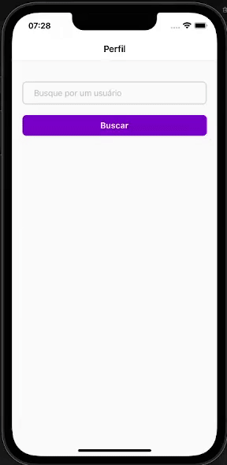

<h1 align="center">
    
</h1>

<h4 align="center"> 
	AluraHub 
</h4>

<p align="center">
  <a href="#information_source-o-que-é-o-ficando-online">O que é o AluraHub?</a>&nbsp;&nbsp;&nbsp;|&nbsp;&nbsp;&nbsp;
  <a href="#rocket-Tecnologias">Tecnologias</a>&nbsp;&nbsp;&nbsp;|&nbsp;&nbsp;&nbsp;
  <a href="#information_source-como-usar">Como usar</a>&nbsp;&nbsp;&nbsp;|&nbsp;&nbsp;&nbsp;
</p>

## :information_source: O que é o AluraHub?

O AluraHub é uma aplicação feita em React Native que permite salvar um perfil com informações como nome da pessoa e uma foto, e possibilita consultar um repositório que armazena dados.

Como ele funciona? O app consome uma API externa, no caso, a API pública do Github ou uma fake API com json-server.

Esse projeto é utilizado no curso 4 da formação base de React Native da plataforma da Alura.


<h1 align="center">
    
</h1>


## :rocket: Tecnologias

Esse projeto foi desenvolvido com a utilização das seguintes tecnologias:
- [React Native][rn]
- [Expo][expo]

## :information_source: Como usar

```bash
# Instale as dependências
$ npm install
```

### Executar o Mobile

```bash
# Executar projeto com expo
$ expo start
```

```bash
# É necessário executar o json-server com o ip da máquina para que o emulador tenha acesso
$ expo start
$ json-server --watch db.json --host 192.XXX.XX.X
```

[nodejs]: https://nodejs.org/
[expo]: https://docs.expo.dev/
[rn]: https://facebook.github.io/react-native/
[yarn]: https://yarnpkg.com/
